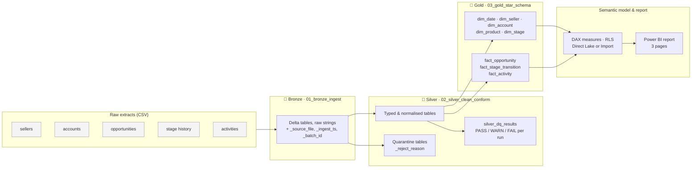

# 🏗️ Sales Pipeline Lakehouse — medallion architecture with PySpark, Delta Lake & Power BI

An end-to-end **Lakehouse** project that turns raw CRM-style sales data into a governed star schema and a
Power BI semantic model: Bronze → Silver → Gold on **Delta Lake**, with data-quality checks, Delta MERGE
upserts, time travel, a Kimball star schema and reconciled DAX measures.

The notebooks are written to run **unchanged** on three platforms:

| Platform | Compute | Semantic model |
|---|---|---|
| **Microsoft Fabric** | Lakehouse notebooks (Spark), Data Pipeline orchestration | Direct Lake |
| **Databricks** (Free Edition or any workspace) | Spark + Delta, Unity Catalog volumes | Power BI Import via export or Databricks connector |
| **Local** | PySpark + delta-spark in Jupyter | Power BI Import from CSV/Parquet export |

All data is **synthetic** — generated by `data/generate_synthetic_data.py` with a fixed seed. No real customer,
seller or company appears anywhere in this repository.

<!-- TODO screenshot: docs/img/page1_pipeline_overview.png -->

---

## Architecture



**Why medallion?** Bronze keeps an auditable copy of what arrived; Silver makes it trustworthy and logs *how*
trustworthy; Gold shapes it for analytics. Each layer is a set of Delta tables, so every step is versioned,
time-travellable and re-runnable.

---

## Repository structure

```
sales-pipeline-lakehouse/
├── data/
│   ├── generate_synthetic_data.py      # deterministic synthetic CRM dataset (seed 42)
│   ├── DATA_QUALITY_NOTES.md           # the 9 data-quality problems planted in the raw files
│   └── raw/                            # generated CSVs (5 files, ~3 MB)
├── notebooks/
│   ├── 01_bronze_ingest.ipynb          # land CSVs as Delta with lineage columns
│   ├── 02_silver_clean_conform.ipynb   # typing, dedup, normalisation, DQ checks, quarantine, MERGE
│   └── 03_gold_star_schema.ipynb       # dimensions, facts, KPI reconciliation, export for Power BI
├── model/
│   ├── dax_measures.md                 # relationships, 35+ DAX measures, RLS, formatting
│   └── report_layout.md                # page-by-page report design
├── docs/
│   └── fabric_deployment.md            # how to run the same code in a Fabric Lakehouse + Data Pipeline
├── requirements.txt                    # local run: pyspark, delta-spark, jupyter, pandas
└── LICENSE
```

---

## What the pipeline does

### 🥉 Bronze — `01_bronze_ingest.ipynb`
* Lands the five CSV extracts into `bronze_*` Delta tables **exactly as received** (all columns as strings).
* Adds lineage: `_source_file` (from `_metadata.file_path`), `_ingest_ts`, `_batch_id`.
* Shows the Delta transaction log (`DESCRIBE HISTORY`).

### 🥈 Silver — `02_silver_clean_conform.ipynb`
* Explicit typing (decimals, dates, timestamps, booleans) and label normalisation
  (`' closed  WON '` → `Closed Won`, `usd` → `USD`).
* **Multi-format date parsing** with `try_to_timestamp` (ISO and `dd/MM/yyyy` in the same column).
* **De-duplication**: exact duplicates dropped; stale versions of the same opportunity superseded by the latest
  `last_modified_ts` using a window function.
* **Referential-integrity and business-rule checks** — unknown accounts/sellers/stages, negative amounts,
  activities dated before their deal existed — with failures routed to **quarantine tables** (never silently dropped).
* **Data-quality log**: every check appends a row to `silver_dq_results` (PASS/WARN/FAIL, failed rows, %, run time);
  a `FAIL` stops the run before Gold.
* **Delta MERGE upsert** for `silver_opportunities` (create on first run, upsert afterwards), `OPTIMIZE`, and a
  **time-travel** query comparing version 0 with the current version.

### 🥇 Gold — `03_gold_star_schema.ipynb`
* Star schema with integer surrogate keys: `dim_date` (calendar + July fiscal year), `dim_seller`, `dim_account`,
  `dim_product`, `dim_stage`; facts `fact_opportunity` (one row per deal), `fact_stage_transition` (stage velocity and
  conversion) and `fact_activity` (seller effort).
* **KPI reconciliation in Spark SQL** — open pipeline, weighted pipeline, won revenue, win rate, average sales
  cycle — so the DAX measures can be validated against a known-good number.
* Export of the Gold tables to CSV and Parquet for Power BI Import mode (not needed in Fabric, where the model is
  Direct Lake).

### 📊 Semantic model & report — `model/`
* 35+ DAX measures: pipeline coverage, weighted pipeline, win rate, quota attainment, sales-cycle days, stage
  conversion and advance rates, seller productivity, activities per won deal, YTD / FYTD / YoY / rolling 3-month.
* Inactive relationship on close date activated with `USERELATIONSHIP`; role-based **RLS** by region.
* Three report pages: Pipeline Overview, Seller Productivity, Sales Cycle & Conversion (+ optional Data Quality page).

---

## Quick start

### Option A — Databricks Free Edition (recommended, free)
1. Create a free workspace at databricks.com (Free Edition) and open **Catalog**.
2. Create schema `workspace.sales_lakehouse` and a **volume** named `raw` inside it (the notebook also tries to
   create both automatically).
3. Upload the five files from `data/raw/` into the `raw` volume.
4. Workspace → **Import** the three notebooks from `notebooks/`.
5. Run `01` → `02` → `03` on serverless compute. Platform is auto-detected; nothing to change.
6. Power BI Desktop: connect with the **Databricks** connector to `workspace.sales_lakehouse.gold_*`, or use
   **Get data → Folder** on the CSV export in the `export` volume. Build the model with `model/dax_measures.md`.

### Option B — Local PySpark
```bash
pip install -r requirements.txt            # pyspark 3.5, delta-spark 3.2, jupyter, pandas
cd data && python generate_synthetic_data.py --out raw && cd ..
cd notebooks && jupyter lab                # run 01 → 02 → 03; tables land in ../lakehouse/
```
Requires Java 8/11/17 on the PATH. The Gold export lands in `lakehouse/export/csv/<table>/` for Power BI Desktop.

### Option C — Microsoft Fabric
See [`docs/fabric_deployment.md`](docs/fabric_deployment.md): create a Lakehouse, upload the raw files to
`Files/raw`, import the notebooks, orchestrate them with a **Data Pipeline**, and build a **Direct Lake** semantic
model on the Gold tables.

---

## Data-quality checks

| Check | Layer | Outcome |
|---|---|---|
| Exact duplicate rows | Silver | dropped, counted |
| Stale opportunity versions | Silver | superseded by latest `last_modified_ts` |
| Label casing / whitespace (stage, currency, lead source) | Silver | normalised |
| Mixed date formats (`yyyy-MM-dd`, `dd/MM/yyyy`) | Silver | parsed with `try_to_timestamp` |
| Missing amount | Silver | kept, flagged `amount_missing` |
| Negative amount | Silver | quarantined |
| Unknown account / seller / stage | Silver | quarantined |
| Activity before opportunity created | Silver | quarantined |
| Closed deal without close date | Silver | logged |

Full details of what was planted in the raw data: [`data/DATA_QUALITY_NOTES.md`](data/DATA_QUALITY_NOTES.md).

---

## Headline numbers (synthetic dataset, snapshot 2025-06-30)

| Metric | Value |
|---|---|
| Opportunities (unique) | 3,000 (417 open, 2,583 closed) |
| Open pipeline | ≈ $9.0M |
| Won revenue | ≈ $18.2M |
| Win rate | ≈ 33 % |
| Average won sales cycle | ≈ 69 days |

Notebook 03 prints the exact values for reconciliation with the DAX measures.

---

## How this maps to the Fabric certifications

| Skill area | Where it is demonstrated |
|---|---|
| **DP-700** Ingest data with pipelines / notebooks | Bronze notebook; Fabric Data Pipeline design in `docs/fabric_deployment.md` |
| **DP-700** Transform with PySpark & Spark SQL | Silver and Gold notebooks (window functions, joins, `try_to_timestamp`, Spark SQL KPI queries) |
| **DP-700** Delta Lake: MERGE, OPTIMIZE, time travel, schema evolution | Silver notebook (`upsert_delta`, `OPTIMIZE`, `versionAsOf`) |
| **DP-700** Data quality & monitoring | `silver_dq_results`, quarantine tables, FAIL gate before Gold |
| **DP-700** Medallion / Lakehouse design | Repo structure, Bronze/Silver/Gold separation |
| **DP-600** Dimensional modelling | Gold star schema, surrogate keys, conformed date & stage dimensions |
| **DP-600** Semantic model & DAX | `model/dax_measures.md` (time intelligence, `USERELATIONSHIP`, RLS) |
| **DP-600** Direct Lake vs Import | `docs/fabric_deployment.md` |

---

## Roadmap
- [ ] Add report screenshots (`docs/img/`)
- [ ] Commit the `.pbip` model and report
- [ ] Incremental Bronze loads partitioned by `_batch_id`
- [ ] SCD Type 2 for `dim_seller` (territory changes)
- [ ] Fabric Data Pipeline JSON export and Direct Lake model when a capacity is available

---

Part of my portfolio — more at [github.com/Mahmoudmostafa911](https://github.com/Mahmoudmostafa911) ·
[LinkedIn](https://www.linkedin.com/in/mahmoud-mostafa-bi-data/)
